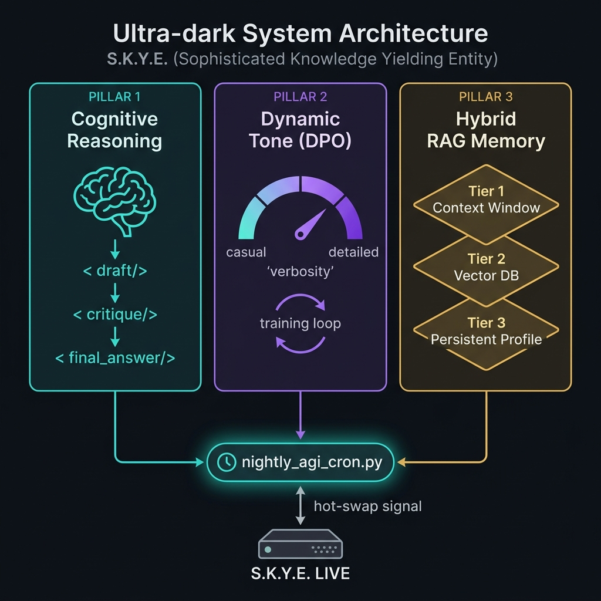

<div align="center">

# S.K.Y.E.
### Sophisticated Knowledge Yielding Entity

*An autonomous, self-learning AI assistant built natively on Apple Silicon*



[](https://python.org)
[](https://github.com/ml-explore/mlx)
[](https://huggingface.co/mlx-community/Meta-Llama-3-8B-Instruct-4bit)
[](LICENSE)

</div>

---

S.K.Y.E. is not a chatbot wrapper. It is a locally-running intelligence engine built on **Meta Llama-3 8B** that continuously learns from its own mistakes, remembers everything you discuss, and evolves its personality overnight — all without sending a single byte of data to the cloud.

---

## ✨ Core Capabilities

| Capability | Status |
|---|---|
| 🔍 Web Search (Wikipedia + Gemini fallback) | ✅ Live |
| 🌤️ Live Weather | ✅ Live |
| 📰 News Summarisation | ✅ Live |
| ⏰ Alarms & Reminders | ✅ Live |
| 🧠 Internal Reasoning (Test-Time Compute) | ✅ Live |
| 🎭 Dynamic Tone & Verbosity (DPO) | ✅ Live |
| 💾 3-Layer Hybrid Memory (RAG) | ✅ Live |
| ⚙️ Nightly Autonomous Self-Training | ✅ Live |
| 🔄 Zero-Downtime Hot-Swapping | ✅ Live |

---

## 🏛️ The Three Pillars of Self-Learning

S.K.Y.E.'s intelligence is built on three autonomous pillars that collectively eliminate the need for manual retraining.

### Pillar 1 — Cognitive Reasoning (Test-Time Compute)
S.K.Y.E. uses a structured internal monologue at generation time. Before every response, she silently reasons through a chain of thought — the user never sees this, only the polished outcome.

```
<draft>   → First-pass reasoning                (hidden from user)
<critique>→ Self-correction of the draft        (hidden from user)
<final_answer> → The clean, delivered response  (visible)
```

This natively eliminates hallucinations and prevents robotic, template-driven replies.

### Pillar 2 — Dynamic Tone & Length (DPO Self-Correction)
The nightly pipeline automatically scans production telemetry for turns where Python guardrails were triggered (e.g. verbosity truncation, repetition loops). It converts each failure into a preference training pair and fine-tunes the LoRA adapters using MLX on-device — so S.K.Y.E. learns the *correct* tone natively, making the Python fallbacks increasingly redundant.

### Pillar 3 — Hybrid RAG Memory (3-Layer Architecture)
S.K.Y.E. has a persistent, hierarchical memory that survives across sessions:

| Tier | Storage | Role |
|---|---|---|
| **1 — Short Term** | Active `SHARED_MESSAGES` list | Current conversation context (2,048 tokens) |
| **2 — Long Term Semantics** | SQLite + `sentence-transformers` Vector DB | Semantic search over all historical conversations |
| **3 — Persistent Profile** | `memory/persistent_profile.json` | Structured facts: your name, preferences, habits |

On every message, S.K.Y.E. runs a **Hybrid Search** (70% vector cosine similarity + 30% keyword boost) over Tier 2 and injects the top-3 most relevant past memories directly into her system prompt before generating a response.

---

## 🤖 Autonomous MLOps Pipeline

The full self-improvement cycle runs via a single command (or a scheduled Cron job):

```bash
python scripts/nightly_agi_cron.py
```

The 5-phase pipeline runs sequentially:

```
Phase 1 │ Fact Extraction          → proposed_facts.py         → updates memory/persistent_profile.json
Phase 2 │ Semantic Ingestion       → ingest_history.py         → indexes logs into memory/semantics.db
Phase 3 │ Dataset Synthesis        → auto_log_to_dpo.py        → converts failures → training pairs
Phase 4 │ On-Device Training       → python -m mlx_lm.lora     → fine-tunes SKYE/ LoRA adapters
Phase 5 │ Zero-Downtime Hot-Swap   → .reload_model_signal      → reloads weights in RAM live
```

The production server detects the signal file and reloads the adapter weights into Unified Memory using a `threading.Lock()` — zero dropped connections.

---

## 📁 Project Structure

```
jarvis/
│
├── core/
│   ├── core_v2.py              # Main production engine (Socket Server + CLI)
│   └── chat_skye.py            # Alternative lightweight CLI interface
│
├── data/
│   ├── build_dataset.py        # [Pillar 1] Initial SFT dataset builder
│   ├── build_dpo_dataset_pillar2.py  # [Pillar 2] DPO preference dataset generator
│   └── auto_log_to_dpo.py      # [Pillar 2] Autonomous failure-to-training-data converter
│
├── scripts/
│   ├── nightly_agi_cron.py     # Master autonomous MLOps orchestrator
│   └── ingest_history.py       # [Pillar 3] Semantic log ingestor
│
├── memory/
│   ├── semantics.db            # SQLite vector store (Tier 2 - generated)
│   ├── persistent_profile.json # Structured user facts (Tier 3 - generated)
│   └── short-term/
│       └── proposed_facts.py   # [Pillar 3] LLM-powered fact extractor
│
├── helper_functions/           # Tool implementations (weather, news, alarms...)
├── SKYE/                       # Trained LoRA adapters (gitignored)
├── logs/                       # Session telemetry JSONL files (gitignored)
├── training_config.json        # MLX LoRA training hyperparameters
└── test_raw.py                 # Raw inference test script
```

---

## 🚀 Getting Started

### Prerequisites
- macOS with Apple Silicon (M1/M2/M3/M4)
- Python 3.11 via `pyenv`
- ~10GB free unified memory

### 1. Clone & Setup Environment
```bash
git clone <your-repo-url>
cd jarvis
pyenv shell jarvis-py311
```

### 2. Install Dependencies
```bash
pip install mlx mlx-lm sentence-transformers numpy scikit-learn wikipedia google-generativeai python-dotenv
```

### 3. Configure Environment
Create a `.env` file in the project root:
```env
GOOGLE_API_KEY=your_key_here   # For web search fallback (Gemini)
WEATHER_API_KEY=your_key_here  # For live weather
```

### 4. Run S.K.Y.E.
```bash
python core/core_v2.py
```
Select **[1]** for an interactive terminal session or **[2]** to expose a Socket Server on port `12345`.

### 5. Trigger Autonomous Learning
After your first conversation session, run the overnight pipeline to let S.K.Y.E. learn from the session:
```bash
python scripts/nightly_agi_cron.py
```

> **Tip**: To make this fully autonomous, add this to your Mac's Crontab (runs at 3 AM nightly):
> ```
> 0 3 * * * cd /path/to/jarvis && /path/to/envs/jarvis-py311/bin/python scripts/nightly_agi_cron.py
> ```

---

## ⚙️ Technical Stack

| Component | Technology |
|---|---|
| **Base LLM** | `mlx-community/Meta-Llama-3-8B-Instruct-4bit` |
| **Training Framework** | `mlx-lm` (Apple Silicon native) |
| **Adapter Type** | LoRA (rank 16, 16 trainable layers) |
| **Embedding Model** | `all-MiniLM-L6-v2` (sentence-transformers) |
| **Vector Store** | SQLite + NumPy cosine similarity |
| **Concurrency** | `threading.Lock()` for hot-swap safety |
| **Telemetry** | JSONL session logs with guardrail annotations |

---

## 🛡️ Guardrail System

S.K.Y.E. has a layered defence against common LLM failure modes, operating as a runtime fail-safe *until* the neural training makes them obsolete:

| Guardrail | Trigger | Action |
|---|---|---|
| `role_integrity_reset` | Role-play leakage detected | Hard reset to SKYE persona |
| `repetition_abort` | Repeated sentences / identical prior turn | Prompt to rephrase |
| `verbosity_truncate` | Response > 200 words or > 8 sentences | Truncate to 8 sentences |
| `personality_dampen` | Over-saturation of butler tokens (`Sir`, `Certainly`) | Suppress excess tokens |
| `low_info_suppression` | Filler phrases detected multiple times | Deduplicate |

---

<div align="center">
  <sub>Built with 🖤 on Apple Silicon</sub>
</div>
